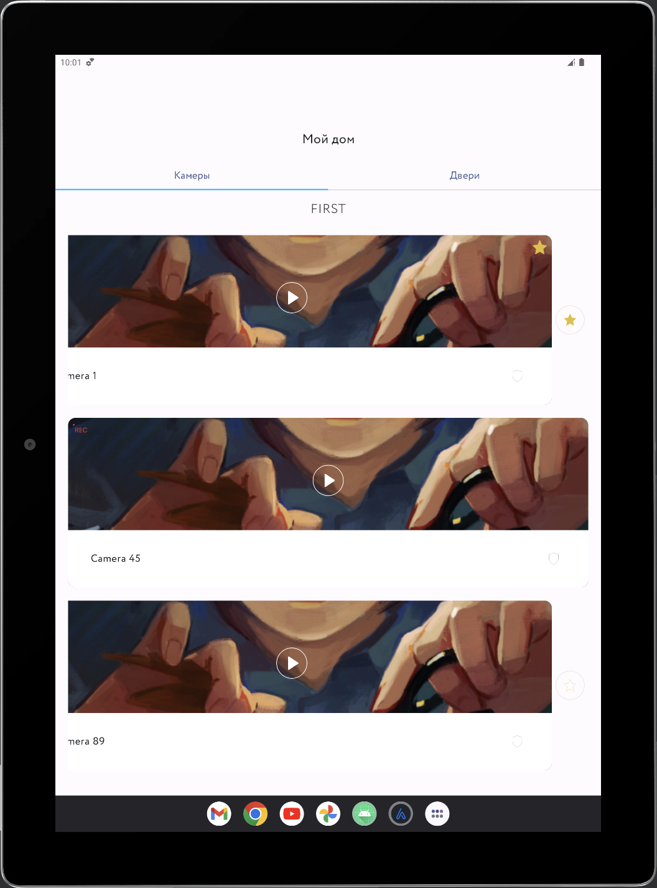

# Choose Your Hero Android App

## Why this app exists

This project is a test task to apply for RickMaster's android developer vacancy.

## What it does

The app shows two lists:

1. list of cameras, grouped by the room they are in
2. list of doors

The data is received from the given API.

The main screen contains a tab menu that helps a user switch between the lists.

The first list shows data about cameras: their names, snapshots, whether they are on and whether they were added to favorite ones. Users can swipe a card and press a button to add a certain camera to favorites.

The second list shows data about doors: their names, snapshots if they have ones and whether they were added to favorites. Users can swipe a card and press a button to add a certain camera to favorites or change its name.

## Screenshots

| cameras screen                                    | doors screen                                                |
|---------------------------------------------------|-------------------------------------------------------------|
|  |  |

## How to run

0. You have to have Android Studio with Kotlin plugin installed
1. Sync project with the gradle files
2. Connect your device or download an emulator
3. Run -> Run

## Known issues

Snapshots: can't access the given urls, have put a static url to replace it.